# MCP Gateway - Architecture Document

## Table of Contents
- [1. Executive Summary](#1-executive-summary)
- [2. High-Level Design (HLD)](#2-high-level-design-hld)
- [3. Low-Level Design (LLD)](#3-low-level-design-lld)
- [4. Sequence Diagrams](#4-sequence-diagrams)
- [5. Component Diagrams](#5-component-diagrams)
- [6. Deployment Architecture](#6-deployment-architecture)
- [7. Data Flow Architecture](#7-data-flow-architecture)
- [8. Security Architecture](#8-security-architecture)
- [9. Performance Considerations](#9-performance-considerations)
- [10. Scalability Design](#10-scalability-design)

---

## 1. Executive Summary

The MCP Gateway is a sophisticated middleware solution that bridges client applications and target APIs through an AI-powered natural language interface. It dynamically converts OpenAPI specifications into Model Context Protocol (MCP) servers, enabling seamless integration between human language queries and REST API operations.

### Key Architectural Principles
- **Microservices Architecture**: Loosely coupled, independently deployable services
- **Event-Driven Design**: Asynchronous communication patterns
- **AI-First Approach**: Natural language as the primary interface
- **Protocol Abstraction**: MCP as the universal tool communication standard
- **Dynamic Generation**: Runtime creation of API integrations

---

## 2. High-Level Design (HLD)

### 2.1 System Overview

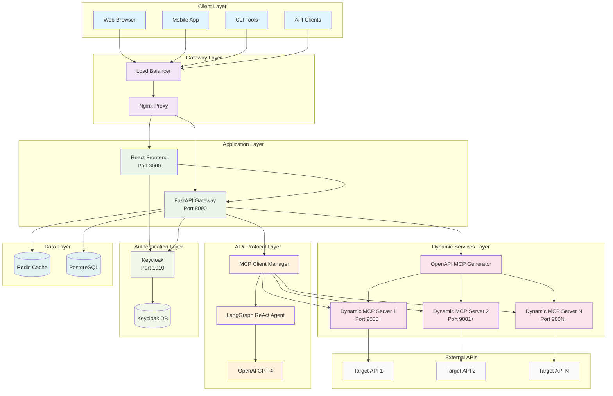
```mermaid
graph TB
    subgraph "Client Layer"
        WEB[Web Browser]
        MOBILE[Mobile App]
        CLI[CLI Tools]
        API_CLIENT[API Clients]
    end
    
    subgraph "Gateway Layer"
        LB[Load Balancer]
        NGINX[Nginx Proxy]
    end
    
    subgraph "Application Layer"
        FRONTEND[React Frontend<br/>Port 3000]
        BACKEND[FastAPI Gateway<br/>Port 8090]
    end
    
    subgraph "AI & Protocol Layer"
        MCP_MANAGER[MCP Client Manager]
        AI_AGENT[LangGraph ReAct Agent]
        OPENAI[OpenAI GPT-4]
    end
    
    subgraph "Dynamic Services Layer"
        MCP_GEN[OpenAPI MCP Generator]
        MCP_SERVER1[Dynamic MCP Server 1<br/>Port 9000+]
        MCP_SERVER2[Dynamic MCP Server 2<br/>Port 9001+]
        MCP_SERVERN[Dynamic MCP Server N<br/>Port 900N+]
    end
    
    subgraph "Authentication Layer"
        KEYCLOAK[Keycloak<br/>Port 1010]
        KC_DB[(Keycloak DB)]
    end
    
    subgraph "Data Layer"
        REDIS[(Redis Cache)]
        POSTGRES[(PostgreSQL)]
    end
    
    subgraph "External APIs"
        API1[Target API 1]
        API2[Target API 2]
        APIN[Target API N]
    end
    
    %% Client connections
    WEB --> LB
    MOBILE --> LB
    CLI --> LB
    API_CLIENT --> LB
    
    %% Gateway routing
    LB --> NGINX
    NGINX --> FRONTEND
    NGINX --> BACKEND
    
    %% Application flow
    FRONTEND --> BACKEND
    BACKEND --> MCP_MANAGER
    MCP_MANAGER --> AI_AGENT
    AI_AGENT --> OPENAI
    
    %% MCP Server management
    BACKEND --> MCP_GEN
    MCP_GEN --> MCP_SERVER1
    MCP_GEN --> MCP_SERVER2
    MCP_GEN --> MCP_SERVERN
    
    %% MCP Client connections
    MCP_MANAGER --> MCP_SERVER1
    MCP_MANAGER --> MCP_SERVER2
    MCP_MANAGER --> MCP_SERVERN
    
    %% External API calls
    MCP_SERVER1 --> API1
    MCP_SERVER2 --> API2
    MCP_SERVERN --> APIN
    
    %% Authentication
    FRONTEND --> KEYCLOAK
    BACKEND --> KEYCLOAK
    KEYCLOAK --> KC_DB
    
    %% Data persistence
    BACKEND --> REDIS
    BACKEND --> POSTGRES
    
    classDef clientLayer fill:#e1f5fe
    classDef gatewayLayer fill:#f3e5f5
    classDef appLayer fill:#e8f5e8
    classDef aiLayer fill:#fff3e0
    classDef mcpLayer fill:#fce4ec
    classDef authLayer fill:#f1f8e9
    classDef dataLayer fill:#e0f2f1
    classDef externalLayer fill:#fafafa
    
    class WEB,MOBILE,CLI,API_CLIENT clientLayer
    class LB,NGINX gatewayLayer
    class FRONTEND,BACKEND appLayer
    class MCP_MANAGER,AI_AGENT,OPENAI aiLayer
    class MCP_GEN,MCP_SERVER1,MCP_SERVER2,MCP_SERVERN mcpLayer
    class KEYCLOAK,KC_DB authLayer
    class REDIS,POSTGRES dataLayer
    class API1,API2,APIN externalLayer
```

### 2.2 Core Components

#### 2.2.1 Frontend Layer (React TypeScript)
- **Technology**: React 19, TypeScript, Tailwind CSS
- **Responsibilities**:
  - User interface for service management
  - AI chat interface
  - Authentication handling
  - Real-time updates and notifications

#### 2.2.2 Backend Layer (FastAPI Python)
- **Technology**: FastAPI, Python 3.13+, Async/Await
- **Responsibilities**:
  - RESTful API endpoints
  - Service registration and management
  - Chat request orchestration
  - Authentication validation

#### 2.2.3 AI & Protocol Layer
- **MCP Client Manager**: Orchestrates multiple MCP server connections
- **LangGraph ReAct Agent**: Intelligent tool selection and execution
- **OpenAI Integration**: Natural language processing and understanding

#### 2.2.4 Dynamic Services Layer
- **OpenAPI MCP Generator**: Converts OpenAPI specs to MCP servers
- **Dynamic MCP Servers**: Runtime-generated API integration points

### 2.3 Technology Stack

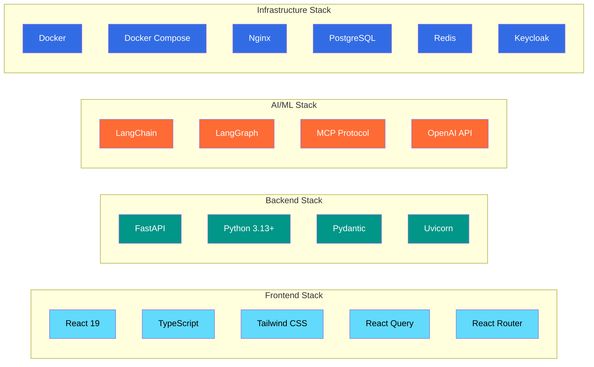
```mermaid
graph LR
    subgraph "Frontend Stack"
        REACT[React 19]
        TS[TypeScript]
        TAILWIND[Tailwind CSS]
        QUERY[React Query]
        ROUTER[React Router]
    end
    
    subgraph "Backend Stack"
        FASTAPI[FastAPI]
        PYTHON[Python 3.13+]
        PYDANTIC[Pydantic]
        UVICORN[Uvicorn]
    end
    
    subgraph "AI/ML Stack"
        LANGCHAIN[LangChain]
        LANGGRAPH[LangGraph]
        MCP[MCP Protocol]
        OPENAI_API[OpenAI API]
    end
    
    subgraph "Infrastructure Stack"
        DOCKER[Docker]
        COMPOSE[Docker Compose]
        NGINX_STACK[Nginx]
        POSTGRES_STACK[PostgreSQL]
        REDIS_STACK[Redis]
        KEYCLOAK_STACK[Keycloak]
    end
    
    classDef frontend fill:#61dafb,color:#000
    classDef backend fill:#009688,color:#fff
    classDef ai fill:#ff6b35,color:#fff
    classDef infra fill:#326ce5,color:#fff
    
    class REACT,TS,TAILWIND,QUERY,ROUTER frontend
    class FASTAPI,PYTHON,PYDANTIC,UVICORN backend
    class LANGCHAIN,LANGGRAPH,MCP,OPENAI_API ai
    class DOCKER,COMPOSE,NGINX_STACK,POSTGRES_STACK,REDIS_STACK,KEYCLOAK_STACK infra
```

---

## 3. Low-Level Design (LLD)

### 3.1 Backend Component Architecture

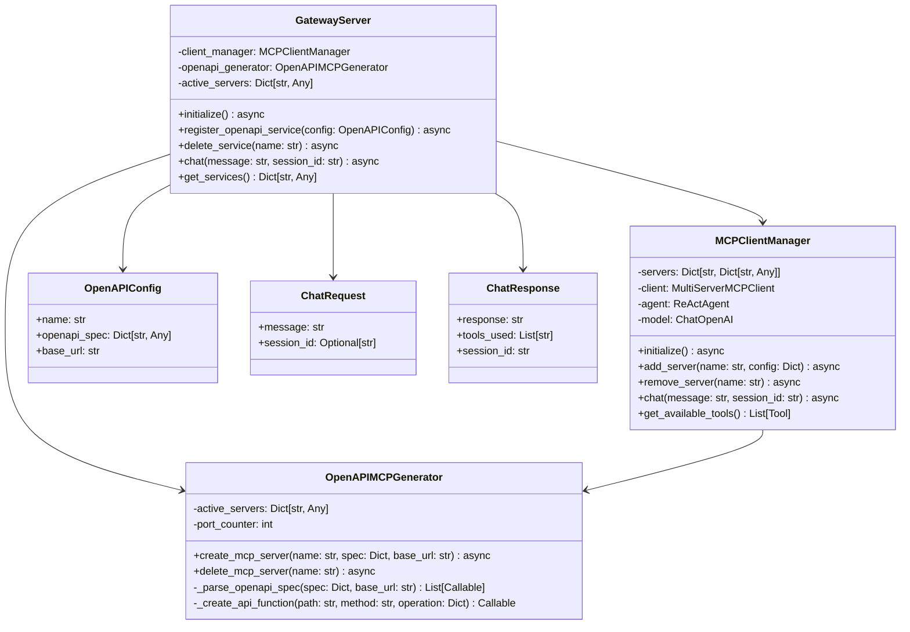
```mermaid
classDiagram
    class GatewayServer {
        -client_manager: MCPClientManager
        -openapi_generator: OpenAPIMCPGenerator
        -active_servers: Dict[str, Any]
        +initialize() async
        +register_openapi_service(config: OpenAPIConfig) async
        +delete_service(name: str) async
        +chat(message: str, session_id: str) async
        +get_services() Dict[str, Any]
    }
    
    class MCPClientManager {
        -servers: Dict[str, Dict[str, Any]]
        -client: MultiServerMCPClient
        -agent: ReActAgent
        -model: ChatOpenAI
        +initialize() async
        +add_server(name: str, config: Dict) async
        +remove_server(name: str) async
        +chat(message: str, session_id: str) async
        +get_available_tools() List[Tool]
    }
    
    class OpenAPIMCPGenerator {
        -active_servers: Dict[str, Any]
        -port_counter: int
        +create_mcp_server(name: str, spec: Dict, base_url: str) async
        +delete_mcp_server(name: str) async
        -_parse_openapi_spec(spec: Dict, base_url: str) List[Callable]
        -_create_api_function(path: str, method: str, operation: Dict) Callable
    }
    
    class OpenAPIConfig {
        +name: str
        +openapi_spec: Dict[str, Any]
        +base_url: str
    }
    
    class ChatRequest {
        +message: str
        +session_id: Optional[str]
    }
    
    class ChatResponse {
        +response: str
        +tools_used: List[str]
        +session_id: str
    }
    
    GatewayServer --> MCPClientManager
    GatewayServer --> OpenAPIMCPGenerator
    GatewayServer --> OpenAPIConfig
    GatewayServer --> ChatRequest
    GatewayServer --> ChatResponse
    MCPClientManager --> OpenAPIMCPGenerator
```

### 3.2 Frontend Component Architecture

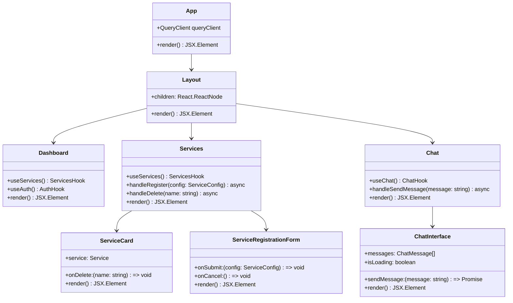
```mermaid
classDiagram
    class App {
        +QueryClient queryClient
        +render() JSX.Element
    }
    
    class Layout {
        +children: React.ReactNode
        +render() JSX.Element
    }
    
    class Dashboard {
        +useServices() ServicesHook
        +useAuth() AuthHook
        +render() JSX.Element
    }
    
    class Services {
        +useServices() ServicesHook
        +handleRegister(config: ServiceConfig) async
        +handleDelete(name: string) async
        +render() JSX.Element
    }
    
    class Chat {
        +useChat() ChatHook
        +handleSendMessage(message: string) async
        +render() JSX.Element
    }
    
    class ServiceCard {
        +service: Service
        +onDelete: (name: string) => void
        +render() JSX.Element
    }
    
    class ChatInterface {
        +messages: ChatMessage[]
        +isLoading: boolean
        +sendMessage: (message: string) => Promise<void>
        +render() JSX.Element
    }
    
    class ServiceRegistrationForm {
        +onSubmit: (config: ServiceConfig) => void
        +onCancel: () => void
        +render() JSX.Element
    }
    
    App --> Layout
    Layout --> Dashboard
    Layout --> Services
    Layout --> Chat
    Services --> ServiceCard
    Services --> ServiceRegistrationForm
    Chat --> ChatInterface
```

### 3.3 Data Models

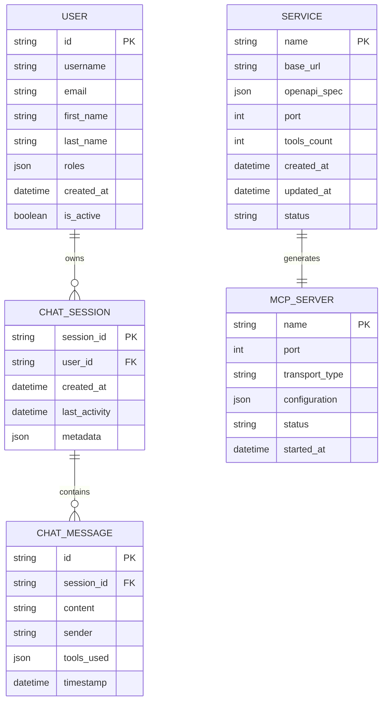
```mermaid
erDiagram
    SERVICE {
        string name PK
        string base_url
        json openapi_spec
        int port
        int tools_count
        datetime created_at
        datetime updated_at
        string status
    }
    
    CHAT_SESSION {
        string session_id PK
        string user_id FK
        datetime created_at
        datetime last_activity
        json metadata
    }
    
    CHAT_MESSAGE {
        string id PK
        string session_id FK
        string content
        string sender
        json tools_used
        datetime timestamp
    }
    
    USER {
        string id PK
        string username
        string email
        string first_name
        string last_name
        json roles
        datetime created_at
        boolean is_active
    }
    
    MCP_SERVER {
        string name PK
        int port
        string transport_type
        json configuration
        string status
        datetime started_at
    }
    
    SERVICE ||--|| MCP_SERVER : generates
    CHAT_SESSION ||--o{ CHAT_MESSAGE : contains
    USER ||--o{ CHAT_SESSION : owns
```

---

## 4. Sequence Diagrams

### 4.1 Service Registration Flow

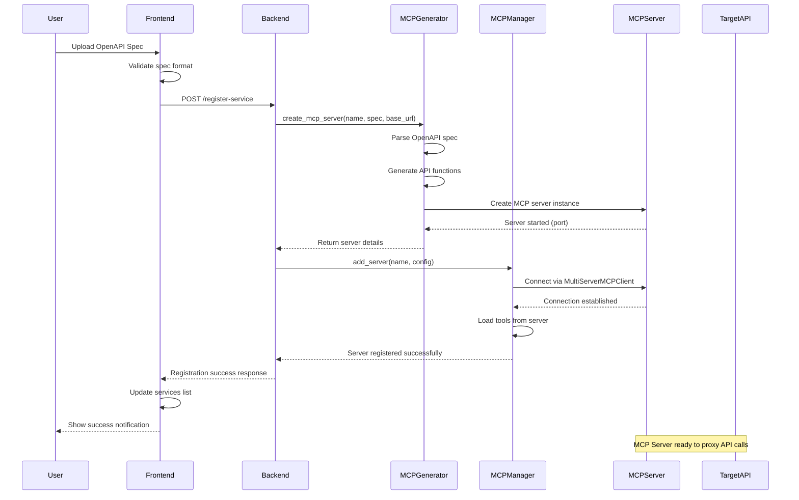
```mermaid
sequenceDiagram
    participant User
    participant Frontend
    participant Backend
    participant MCPGenerator
    participant MCPManager
    participant MCPServer
    participant TargetAPI
    
    User->>Frontend: Upload OpenAPI Spec
    Frontend->>Frontend: Validate spec format
    Frontend->>Backend: POST /register-service
    
    Backend->>MCPGenerator: create_mcp_server(name, spec, base_url)
    MCPGenerator->>MCPGenerator: Parse OpenAPI spec
    MCPGenerator->>MCPGenerator: Generate API functions
    MCPGenerator->>MCPServer: Create MCP server instance
    MCPServer-->>MCPGenerator: Server started (port)
    MCPGenerator-->>Backend: Return server details
    
    Backend->>MCPManager: add_server(name, config)
    MCPManager->>MCPServer: Connect via MultiServerMCPClient
    MCPServer-->>MCPManager: Connection established
    MCPManager->>MCPManager: Load tools from server
    MCPManager-->>Backend: Server registered successfully
    
    Backend-->>Frontend: Registration success response
    Frontend->>Frontend: Update services list
    Frontend-->>User: Show success notification
    
    Note over MCPServer, TargetAPI: MCP Server ready to proxy API calls
```

### 4.2 Chat Interaction Flow

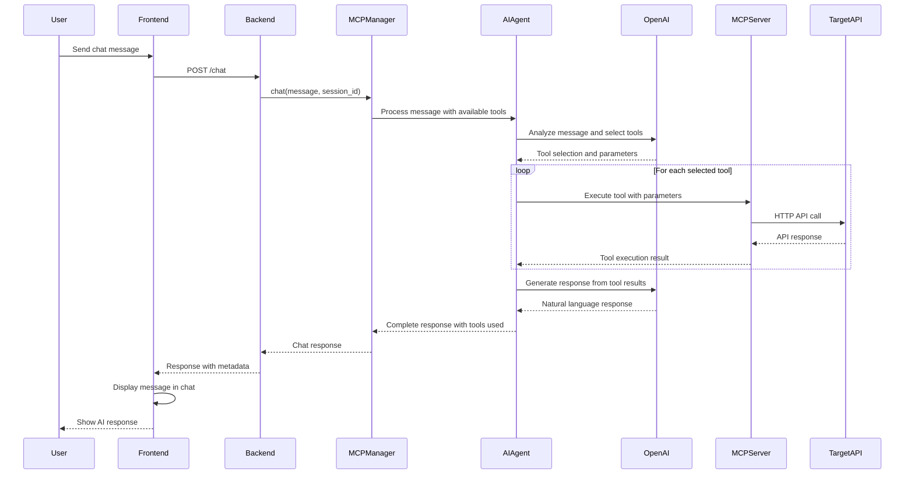
```mermaid
sequenceDiagram
    participant User
    participant Frontend
    participant Backend
    participant MCPManager
    participant AIAgent
    participant OpenAI
    participant MCPServer
    participant TargetAPI
    
    User->>Frontend: Send chat message
    Frontend->>Backend: POST /chat
    Backend->>MCPManager: chat(message, session_id)
    
    MCPManager->>AIAgent: Process message with available tools
    AIAgent->>OpenAI: Analyze message and select tools
    OpenAI-->>AIAgent: Tool selection and parameters
    
    loop For each selected tool
        AIAgent->>MCPServer: Execute tool with parameters
        MCPServer->>TargetAPI: HTTP API call
        TargetAPI-->>MCPServer: API response
        MCPServer-->>AIAgent: Tool execution result
    end
    
    AIAgent->>OpenAI: Generate response from tool results
    OpenAI-->>AIAgent: Natural language response
    AIAgent-->>MCPManager: Complete response with tools used
    MCPManager-->>Backend: Chat response
    Backend-->>Frontend: Response with metadata
    Frontend->>Frontend: Display message in chat
    Frontend-->>User: Show AI response
```

### 4.3 System Initialization Flow

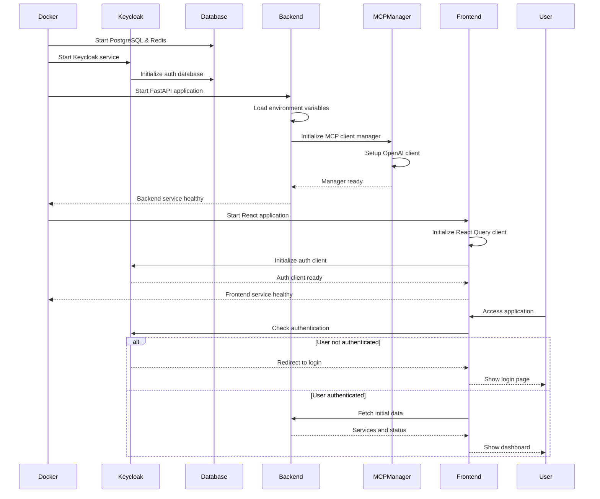
```mermaid
sequenceDiagram
    participant Docker
    participant Keycloak
    participant Database
    participant Backend
    participant MCPManager
    participant Frontend
    participant User
    
    Docker->>Database: Start PostgreSQL & Redis
    Docker->>Keycloak: Start Keycloak service
    Keycloak->>Database: Initialize auth database
    
    Docker->>Backend: Start FastAPI application
    Backend->>Backend: Load environment variables
    Backend->>MCPManager: Initialize MCP client manager
    MCPManager->>MCPManager: Setup OpenAI client
    MCPManager-->>Backend: Manager ready
    Backend-->>Docker: Backend service healthy
    
    Docker->>Frontend: Start React application
    Frontend->>Frontend: Initialize React Query client
    Frontend->>Keycloak: Initialize auth client
    Keycloak-->>Frontend: Auth client ready
    Frontend-->>Docker: Frontend service healthy
    
    User->>Frontend: Access application
    Frontend->>Keycloak: Check authentication
    alt User not authenticated
        Keycloak-->>Frontend: Redirect to login
        Frontend-->>User: Show login page
    else User authenticated
        Frontend->>Backend: Fetch initial data
        Backend-->>Frontend: Services and status
        Frontend-->>User: Show dashboard
    end
```

### 4.4 Service Deletion Flow

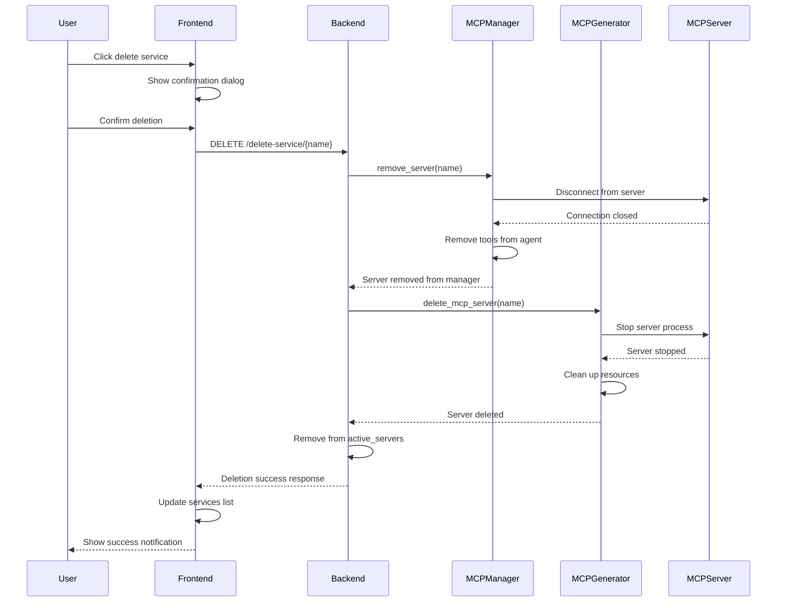
```mermaid
sequenceDiagram
    participant User
    participant Frontend
    participant Backend
    participant MCPManager
    participant MCPGenerator
    participant MCPServer
    
    User->>Frontend: Click delete service
    Frontend->>Frontend: Show confirmation dialog
    User->>Frontend: Confirm deletion
    Frontend->>Backend: DELETE /delete-service/{name}
    
    Backend->>MCPManager: remove_server(name)
    MCPManager->>MCPServer: Disconnect from server
    MCPServer-->>MCPManager: Connection closed
    MCPManager->>MCPManager: Remove tools from agent
    MCPManager-->>Backend: Server removed from manager
    
    Backend->>MCPGenerator: delete_mcp_server(name)
    MCPGenerator->>MCPServer: Stop server process
    MCPServer-->>MCPGenerator: Server stopped
    MCPGenerator->>MCPGenerator: Clean up resources
    MCPGenerator-->>Backend: Server deleted
    
    Backend->>Backend: Remove from active_servers
    Backend-->>Frontend: Deletion success response
    Frontend->>Frontend: Update services list
    Frontend-->>User: Show success notification
```

---

## 5. Component Diagrams

### 5.1 System Component Overview

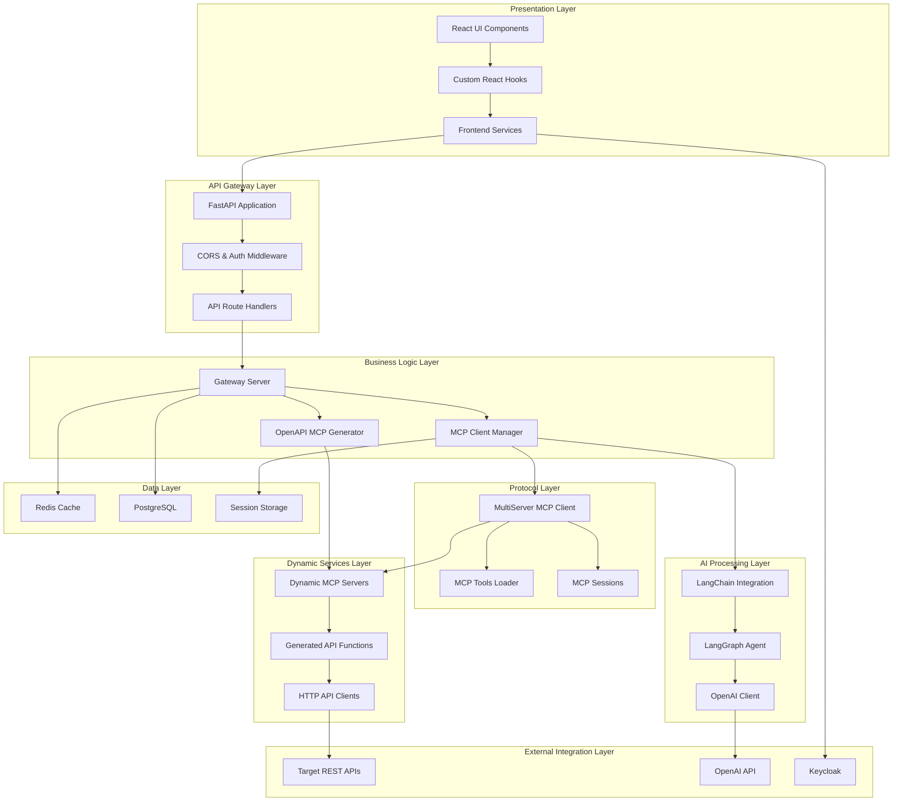
```mermaid
graph TB
    subgraph "Presentation Layer"
        UI[React UI Components]
        HOOKS[Custom React Hooks]
        SERVICES[Frontend Services]
    end
    
    subgraph "API Gateway Layer"
        FASTAPI[FastAPI Application]
        MIDDLEWARE[CORS & Auth Middleware]
        ROUTES[API Route Handlers]
    end
    
    subgraph "Business Logic Layer"
        GATEWAY[Gateway Server]
        MCP_MGR[MCP Client Manager]
        OPENAPI_GEN[OpenAPI MCP Generator]
    end
    
    subgraph "AI Processing Layer"
        LANGCHAIN[LangChain Integration]
        LANGGRAPH[LangGraph Agent]
        OPENAI_CLIENT[OpenAI Client]
    end
    
    subgraph "Protocol Layer"
        MCP_CLIENT[MultiServer MCP Client]
        MCP_TOOLS[MCP Tools Loader]
        MCP_SESSIONS[MCP Sessions]
    end
    
    subgraph "Dynamic Services Layer"
        DYNAMIC_SERVERS[Dynamic MCP Servers]
        API_FUNCTIONS[Generated API Functions]
        HTTP_CLIENTS[HTTP API Clients]
    end
    
    subgraph "External Integration Layer"
        TARGET_APIS[Target REST APIs]
        OPENAI_API[OpenAI API]
        AUTH_PROVIDER[Keycloak]
    end
    
    subgraph "Data Layer"
        CACHE[Redis Cache]
        DATABASE[PostgreSQL]
        SESSION_STORE[Session Storage]
    end
    
    %% Connections
    UI --> HOOKS
    HOOKS --> SERVICES
    SERVICES --> FASTAPI
    
    FASTAPI --> MIDDLEWARE
    MIDDLEWARE --> ROUTES
    ROUTES --> GATEWAY
    
    GATEWAY --> MCP_MGR
    GATEWAY --> OPENAPI_GEN
    
    MCP_MGR --> LANGCHAIN
    LANGCHAIN --> LANGGRAPH
    LANGGRAPH --> OPENAI_CLIENT
    
    MCP_MGR --> MCP_CLIENT
    MCP_CLIENT --> MCP_TOOLS
    MCP_CLIENT --> MCP_SESSIONS
    
    OPENAPI_GEN --> DYNAMIC_SERVERS
    DYNAMIC_SERVERS --> API_FUNCTIONS
    API_FUNCTIONS --> HTTP_CLIENTS
    
    MCP_CLIENT --> DYNAMIC_SERVERS
    HTTP_CLIENTS --> TARGET_APIS
    OPENAI_CLIENT --> OPENAI_API
    SERVICES --> AUTH_PROVIDER
    
    GATEWAY --> CACHE
    GATEWAY --> DATABASE
    MCP_MGR --> SESSION_STORE
```

### 5.2 MCP Integration Architecture

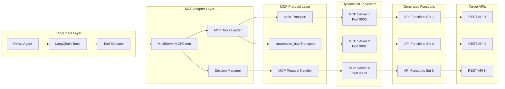
```mermaid
graph LR
    subgraph "LangChain Layer"
        AGENT[ReAct Agent]
        TOOLS[LangChain Tools]
        EXECUTOR[Tool Executor]
    end
    
    subgraph "MCP Adapter Layer"
        MULTI_CLIENT[MultiServerMCPClient]
        TOOL_LOADER[MCP Tools Loader]
        SESSION_MGR[Session Manager]
    end
    
    subgraph "MCP Protocol Layer"
        STDIO_TRANSPORT[stdio Transport]
        HTTP_TRANSPORT[streamable_http Transport]
        MCP_PROTOCOL[MCP Protocol Handler]
    end
    
    subgraph "Dynamic MCP Servers"
        SERVER_1[MCP Server 1<br/>Port 9000]
        SERVER_2[MCP Server 2<br/>Port 9001]
        SERVER_N[MCP Server N<br/>Port 900N]
    end
    
    subgraph "Generated Functions"
        API_FUNC_1[API Functions Set 1]
        API_FUNC_2[API Functions Set 2]
        API_FUNC_N[API Functions Set N]
    end
    
    subgraph "Target APIs"
        REST_API_1[REST API 1]
        REST_API_2[REST API 2]
        REST_API_N[REST API N]
    end
    
    AGENT --> TOOLS
    TOOLS --> EXECUTOR
    EXECUTOR --> MULTI_CLIENT
    
    MULTI_CLIENT --> TOOL_LOADER
    MULTI_CLIENT --> SESSION_MGR
    
    TOOL_LOADER --> STDIO_TRANSPORT
    TOOL_LOADER --> HTTP_TRANSPORT
    SESSION_MGR --> MCP_PROTOCOL
    
    STDIO_TRANSPORT --> SERVER_1
    HTTP_TRANSPORT --> SERVER_2
    MCP_PROTOCOL --> SERVER_N
    
    SERVER_1 --> API_FUNC_1
    SERVER_2 --> API_FUNC_2
    SERVER_N --> API_FUNC_N
    
    API_FUNC_1 --> REST_API_1
    API_FUNC_2 --> REST_API_2
    API_FUNC_N --> REST_API_N
```

---

## 6. Deployment Architecture

### 6.1 Development Deployment

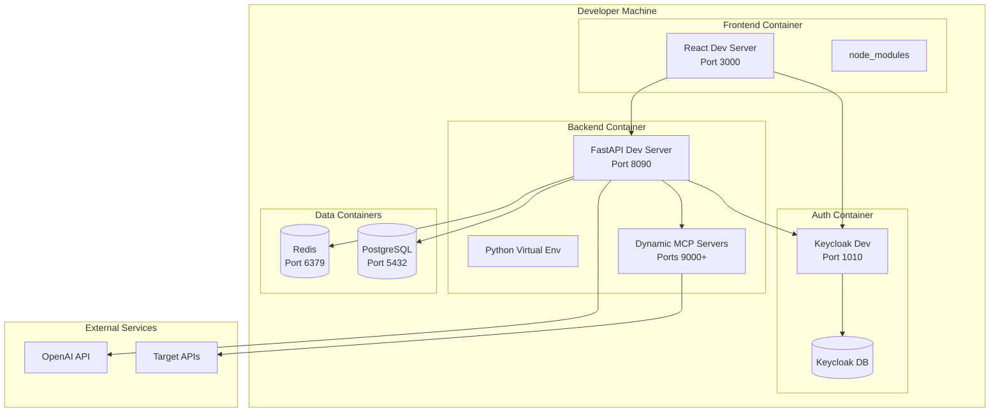
```mermaid
graph TB
    subgraph "Developer Machine"
        subgraph "Frontend Container"
            REACT_DEV[React Dev Server<br/>Port 3000]
            NODE_MODULES[node_modules]
        end
        
        subgraph "Backend Container"
            FASTAPI_DEV[FastAPI Dev Server<br/>Port 8090]
            PYTHON_VENV[Python Virtual Env]
            MCP_SERVERS[Dynamic MCP Servers<br/>Ports 9000+]
        end
        
        subgraph "Auth Container"
            KEYCLOAK_DEV[Keycloak Dev<br/>Port 1010]
            KC_DB_DEV[(Keycloak DB)]
        end
        
        subgraph "Data Containers"
            REDIS_DEV[(Redis<br/>Port 6379)]
            POSTGRES_DEV[(PostgreSQL<br/>Port 5432)]
        end
    end
    
    subgraph "External Services"
        OPENAI_EXT[OpenAI API]
        TARGET_APIS_EXT[Target APIs]
    end
    
    REACT_DEV --> FASTAPI_DEV
    FASTAPI_DEV --> MCP_SERVERS
    REACT_DEV --> KEYCLOAK_DEV
    FASTAPI_DEV --> KEYCLOAK_DEV
    KEYCLOAK_DEV --> KC_DB_DEV
    FASTAPI_DEV --> REDIS_DEV
    FASTAPI_DEV --> POSTGRES_DEV
    MCP_SERVERS --> TARGET_APIS_EXT
    FASTAPI_DEV --> OPENAI_EXT
```

### 6.2 Production Deployment

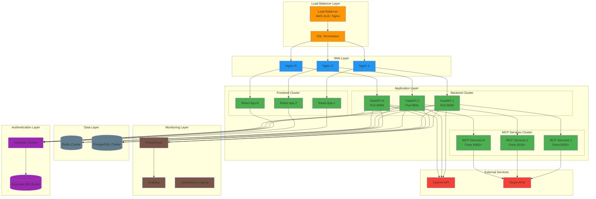
```mermaid
graph TB
    subgraph "Load Balancer Layer"
        LB[Load Balancer<br/>AWS ALB / Nginx]
        SSL[SSL Termination]
    end
    
    subgraph "Web Layer"
        NGINX1[Nginx 1]
        NGINX2[Nginx 2]
        NGINX3[Nginx N]
    end
    
    subgraph "Application Layer"
        subgraph "Frontend Cluster"
            REACT1[React App 1]
            REACT2[React App 2]
            REACT3[React App N]
        end
        
        subgraph "Backend Cluster"
            API1[FastAPI 1<br/>Port 8090]
            API2[FastAPI 2<br/>Port 8091]
            API3[FastAPI N<br/>Port 809N]
        end
        
        subgraph "MCP Services Cluster"
            MCP1[MCP Services 1<br/>Ports 9000+]
            MCP2[MCP Services 2<br/>Ports 9100+]
            MCP3[MCP Services N<br/>Ports 9N00+]
        end
    end
    
    subgraph "Authentication Layer"
        KC_CLUSTER[Keycloak Cluster]
        KC_DB_CLUSTER[(Keycloak DB Cluster)]
    end
    
    subgraph "Data Layer"
        REDIS_CLUSTER[(Redis Cluster)]
        PG_CLUSTER[(PostgreSQL Cluster)]
    end
    
    subgraph "Monitoring Layer"
        PROMETHEUS[Prometheus]
        GRAFANA[Grafana]
        LOGS[Centralized Logging]
    end
    
    subgraph "External Services"
        OPENAI_PROD[OpenAI API]
        TARGET_APIS_PROD[Target APIs]
    end
    
    LB --> SSL
    SSL --> NGINX1
    SSL --> NGINX2
    SSL --> NGINX3
    
    NGINX1 --> REACT1
    NGINX2 --> REACT2
    NGINX3 --> REACT3
    
    NGINX1 --> API1
    NGINX2 --> API2
    NGINX3 --> API3
    
    API1 --> MCP1
    API2 --> MCP2
    API3 --> MCP3
    
    REACT1 --> KC_CLUSTER
    REACT2 --> KC_CLUSTER
    REACT3 --> KC_CLUSTER
    
    API1 --> KC_CLUSTER
    API2 --> KC_CLUSTER
    API3 --> KC_CLUSTER
    
    KC_CLUSTER --> KC_DB_CLUSTER
    
    API1 --> REDIS_CLUSTER
    API2 --> REDIS_CLUSTER
    API3 --> REDIS_CLUSTER
    
    API1 --> PG_CLUSTER
    API2 --> PG_CLUSTER
    API3 --> PG_CLUSTER
    
    MCP1 --> TARGET_APIS_PROD
    MCP2 --> TARGET_APIS_PROD
    MCP3 --> TARGET_APIS_PROD
    
    API1 --> OPENAI_PROD
    API2 --> OPENAI_PROD
    API3 --> OPENAI_PROD
    
    API1 --> PROMETHEUS
    API2 --> PROMETHEUS
    API3 --> PROMETHEUS
    PROMETHEUS --> GRAFANA
    
    classDef lb fill:#ff9800
    classDef web fill:#2196f3
    classDef app fill:#4caf50
    classDef auth fill:#9c27b0
    classDef data fill:#607d8b
    classDef monitor fill:#795548
    classDef external fill:#f44336
    
    class LB,SSL lb
    class NGINX1,NGINX2,NGINX3 web
    class REACT1,REACT2,REACT3,API1,API2,API3,MCP1,MCP2,MCP3 app
    class KC_CLUSTER,KC_DB_CLUSTER auth
    class REDIS_CLUSTER,PG_CLUSTER data
    class PROMETHEUS,GRAFANA,LOGS monitor
    class OPENAI_PROD,TARGET_APIS_PROD external
```

---

## 7. Data Flow Architecture

### 7.1 Request Processing Flow

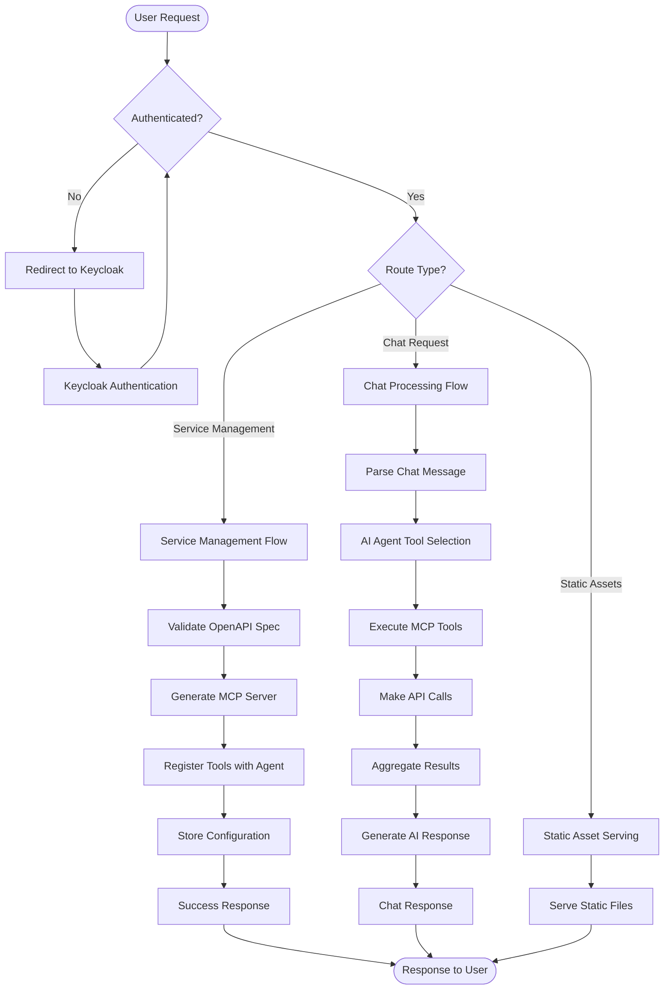
```mermaid
flowchart TD
    START([User Request]) --> AUTH{Authenticated?}
    AUTH -->|No| LOGIN[Redirect to Keycloak]
    LOGIN --> KEYCLOAK[Keycloak Authentication]
    KEYCLOAK --> AUTH
    
    AUTH -->|Yes| ROUTE{Route Type?}
    
    ROUTE -->|Service Management| SERVICE_FLOW[Service Management Flow]
    ROUTE -->|Chat Request| CHAT_FLOW[Chat Processing Flow]
    ROUTE -->|Static Assets| STATIC_FLOW[Static Asset Serving]
    
    SERVICE_FLOW --> VALIDATE_SPEC[Validate OpenAPI Spec]
    VALIDATE_SPEC --> GENERATE_MCP[Generate MCP Server]
    GENERATE_MCP --> REGISTER_TOOLS[Register Tools with Agent]
    REGISTER_TOOLS --> STORE_CONFIG[Store Configuration]
    STORE_CONFIG --> RESPONSE_SUCCESS[Success Response]
    
    CHAT_FLOW --> PARSE_MESSAGE[Parse Chat Message]
    PARSE_MESSAGE --> SELECT_TOOLS[AI Agent Tool Selection]
    SELECT_TOOLS --> EXECUTE_TOOLS[Execute MCP Tools]
    EXECUTE_TOOLS --> API_CALLS[Make API Calls]
    API_CALLS --> AGGREGATE_RESULTS[Aggregate Results]
    AGGREGATE_RESULTS --> GENERATE_RESPONSE[Generate AI Response]
    GENERATE_RESPONSE --> CHAT_RESPONSE[Chat Response]
    
    STATIC_FLOW --> SERVE_STATIC[Serve Static Files]
    
    RESPONSE_SUCCESS --> END([Response to User])
    CHAT_RESPONSE --> END
    SERVE_STATIC --> END
```

### 7.2 Data Transformation Pipeline

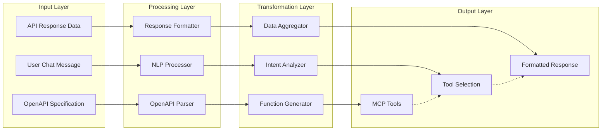
```mermaid
flowchart LR
    subgraph "Input Layer"
        OPENAPI_SPEC[OpenAPI Specification]
        USER_MESSAGE[User Chat Message]
        API_RESPONSE[API Response Data]
    end
    
    subgraph "Processing Layer"
        SPEC_PARSER[OpenAPI Parser]
        NLP_PROCESSOR[NLP Processor]
        RESPONSE_FORMATTER[Response Formatter]
    end
    
    subgraph "Transformation Layer"
        FUNCTION_GENERATOR[Function Generator]
        INTENT_ANALYZER[Intent Analyzer]
        DATA_AGGREGATOR[Data Aggregator]
    end
    
    subgraph "Output Layer"
        MCP_TOOLS[MCP Tools]
        TOOL_SELECTION[Tool Selection]
        FORMATTED_RESPONSE[Formatted Response]
    end
    
    OPENAPI_SPEC --> SPEC_PARSER
    SPEC_PARSER --> FUNCTION_GENERATOR
    FUNCTION_GENERATOR --> MCP_TOOLS
    
    USER_MESSAGE --> NLP_PROCESSOR
    NLP_PROCESSOR --> INTENT_ANALYZER
    INTENT_ANALYZER --> TOOL_SELECTION
    
    API_RESPONSE --> RESPONSE_FORMATTER
    RESPONSE_FORMATTER --> DATA_AGGREGATOR
    DATA_AGGREGATOR --> FORMATTED_RESPONSE
    
    MCP_TOOLS -.-> TOOL_SELECTION
    TOOL_SELECTION -.-> FORMATTED_RESPONSE
```

---

## 8. Security Architecture

### 8.1 Security Layers

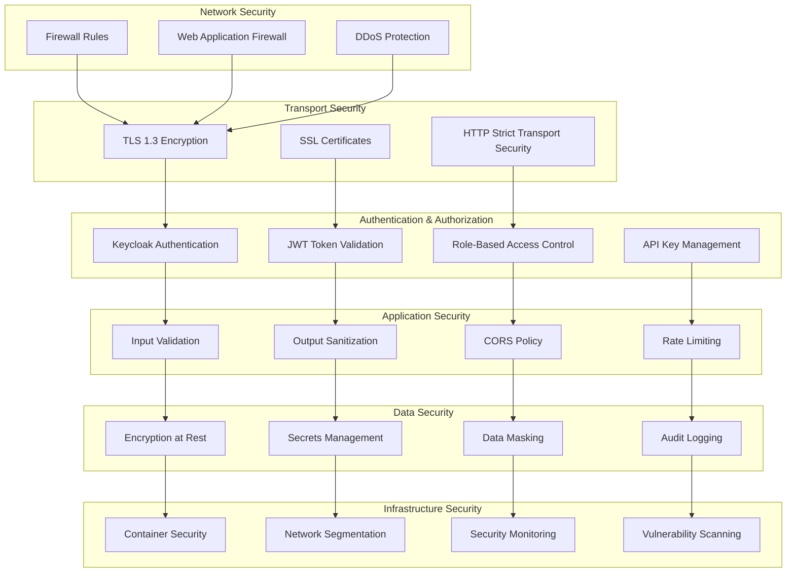
```mermaid
graph TB
    subgraph "Network Security"
        FIREWALL[Firewall Rules]
        WAF[Web Application Firewall]
        DDOS[DDoS Protection]
    end
    
    subgraph "Transport Security"
        TLS[TLS 1.3 Encryption]
        CERT[SSL Certificates]
        HSTS[HTTP Strict Transport Security]
    end
    
    subgraph "Authentication & Authorization"
        KEYCLOAK_AUTH[Keycloak Authentication]
        JWT_TOKENS[JWT Token Validation]
        RBAC[Role-Based Access Control]
        API_KEYS[API Key Management]
    end
    
    subgraph "Application Security"
        INPUT_VALIDATION[Input Validation]
        OUTPUT_SANITIZATION[Output Sanitization]
        CORS_POLICY[CORS Policy]
        RATE_LIMITING[Rate Limiting]
    end
    
    subgraph "Data Security"
        ENCRYPTION_AT_REST[Encryption at Rest]
        SECRETS_MANAGEMENT[Secrets Management]
        DATA_MASKING[Data Masking]
        AUDIT_LOGGING[Audit Logging]
    end
    
    subgraph "Infrastructure Security"
        CONTAINER_SECURITY[Container Security]
        NETWORK_SEGMENTATION[Network Segmentation]
        MONITORING[Security Monitoring]
        VULNERABILITY_SCANNING[Vulnerability Scanning]
    end
    
    FIREWALL --> TLS
    WAF --> TLS
    DDOS --> TLS
    
    TLS --> KEYCLOAK_AUTH
    CERT --> JWT_TOKENS
    HSTS --> RBAC
    
    KEYCLOAK_AUTH --> INPUT_VALIDATION
    JWT_TOKENS --> OUTPUT_SANITIZATION
    RBAC --> CORS_POLICY
    API_KEYS --> RATE_LIMITING
    
    INPUT_VALIDATION --> ENCRYPTION_AT_REST
    OUTPUT_SANITIZATION --> SECRETS_MANAGEMENT
    CORS_POLICY --> DATA_MASKING
    RATE_LIMITING --> AUDIT_LOGGING
    
    ENCRYPTION_AT_REST --> CONTAINER_SECURITY
    SECRETS_MANAGEMENT --> NETWORK_SEGMENTATION
    DATA_MASKING --> MONITORING
    AUDIT_LOGGING --> VULNERABILITY_SCANNING
```

### 8.2 Authentication Flow

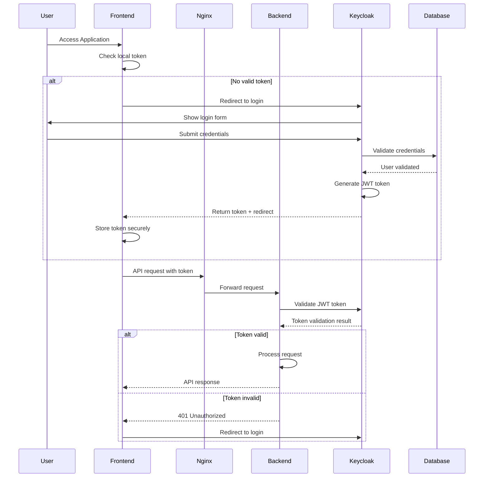
```mermaid
sequenceDiagram
    participant User
    participant Frontend
    participant Nginx
    participant Backend
    participant Keycloak
    participant Database
    
    User->>Frontend: Access Application
    Frontend->>Frontend: Check local token
    
    alt No valid token
        Frontend->>Keycloak: Redirect to login
        Keycloak->>User: Show login form
        User->>Keycloak: Submit credentials
        Keycloak->>Database: Validate credentials
        Database-->>Keycloak: User validated
        Keycloak->>Keycloak: Generate JWT token
        Keycloak-->>Frontend: Return token + redirect
        Frontend->>Frontend: Store token securely
    end
    
    Frontend->>Nginx: API request with token
    Nginx->>Backend: Forward request
    Backend->>Keycloak: Validate JWT token
    Keycloak-->>Backend: Token validation result
    
    alt Token valid
        Backend->>Backend: Process request
        Backend-->>Frontend: API response
    else Token invalid
        Backend-->>Frontend: 401 Unauthorized
        Frontend->>Keycloak: Redirect to login
    end
```

---

## 9. Performance Considerations

### 9.1 Performance Optimization Strategy

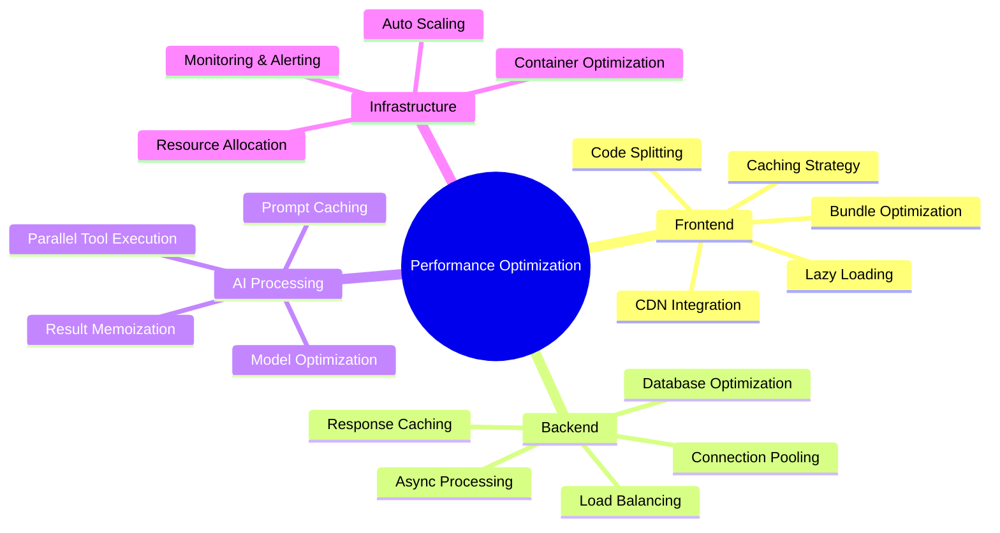
```mermaid
mindmap
  root((Performance Optimization))
    Frontend
      Code Splitting
      Lazy Loading
      Bundle Optimization
      Caching Strategy
      CDN Integration
    Backend
      Async Processing
      Connection Pooling
      Database Optimization
      Response Caching
      Load Balancing
    AI Processing
      Model Optimization
      Prompt Caching
      Parallel Tool Execution
      Result Memoization
    Infrastructure
      Container Optimization
      Resource Allocation
      Auto Scaling
      Monitoring & Alerting
```

### 9.2 Caching Architecture

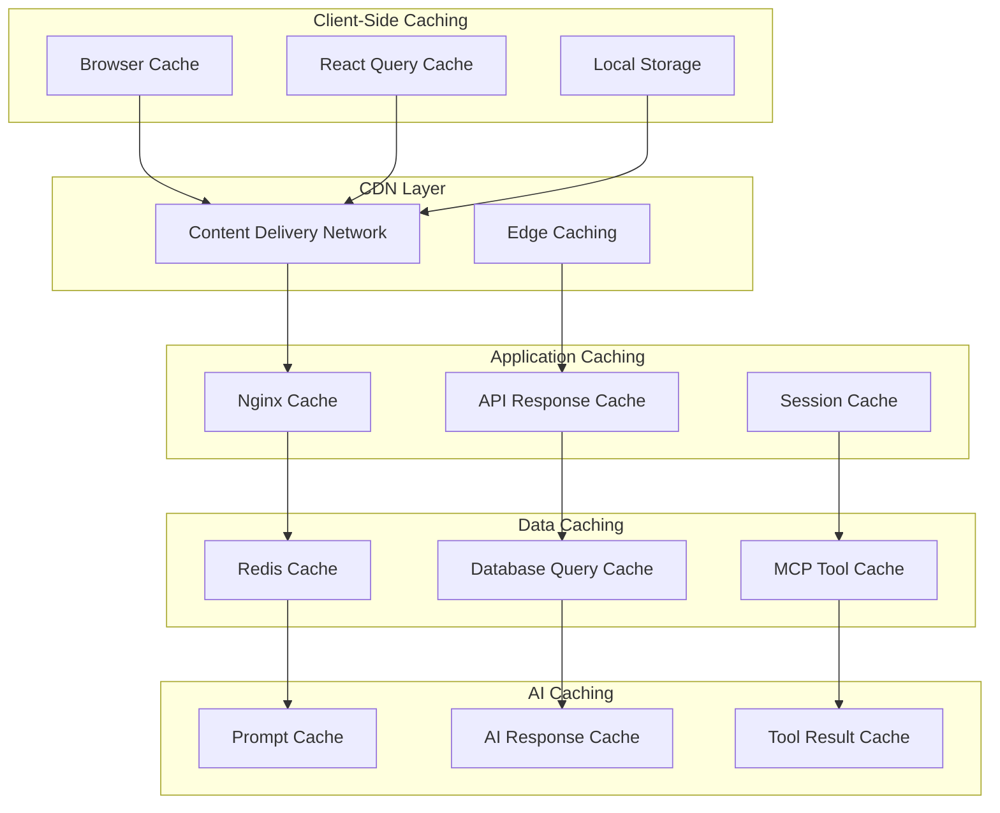
```mermaid
graph TB
    subgraph "Client-Side Caching"
        BROWSER_CACHE[Browser Cache]
        REACT_QUERY[React Query Cache]
        LOCAL_STORAGE[Local Storage]
    end
    
    subgraph "CDN Layer"
        CDN[Content Delivery Network]
        EDGE_CACHE[Edge Caching]
    end
    
    subgraph "Application Caching"
        NGINX_CACHE[Nginx Cache]
        API_CACHE[API Response Cache]
        SESSION_CACHE[Session Cache]
    end
    
    subgraph "Data Caching"
        REDIS_CACHE[Redis Cache]
        DB_QUERY_CACHE[Database Query Cache]
        MCP_TOOL_CACHE[MCP Tool Cache]
    end
    
    subgraph "AI Caching"
        PROMPT_CACHE[Prompt Cache]
        RESPONSE_CACHE[AI Response Cache]
        TOOL_RESULT_CACHE[Tool Result Cache]
    end
    
    BROWSER_CACHE --> CDN
    REACT_QUERY --> CDN
    LOCAL_STORAGE --> CDN
    
    CDN --> NGINX_CACHE
    EDGE_CACHE --> API_CACHE
    
    NGINX_CACHE --> REDIS_CACHE
    API_CACHE --> DB_QUERY_CACHE
    SESSION_CACHE --> MCP_TOOL_CACHE
    
    REDIS_CACHE --> PROMPT_CACHE
    DB_QUERY_CACHE --> RESPONSE_CACHE
    MCP_TOOL_CACHE --> TOOL_RESULT_CACHE
```

---

## 10. Scalability Design

### 10.1 Horizontal Scaling Strategy

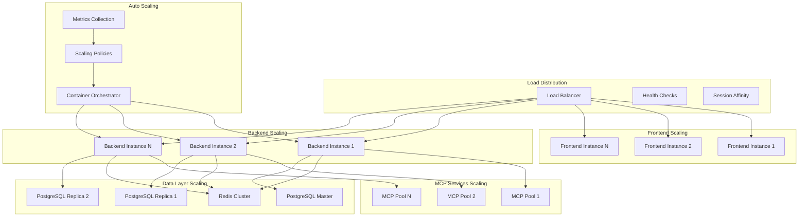
```mermaid
graph TB
    subgraph "Load Distribution"
        LB[Load Balancer]
        HEALTH_CHECK[Health Checks]
        STICKY_SESSION[Session Affinity]
    end
    
    subgraph "Frontend Scaling"
        FE1[Frontend Instance 1]
        FE2[Frontend Instance 2]
        FEN[Frontend Instance N]
    end
    
    subgraph "Backend Scaling"
        BE1[Backend Instance 1]
        BE2[Backend Instance 2]
        BEN[Backend Instance N]
    end
    
    subgraph "MCP Services Scaling"
        MCP_POOL1[MCP Pool 1]
        MCP_POOL2[MCP Pool 2]
        MCP_POOLN[MCP Pool N]
    end
    
    subgraph "Data Layer Scaling"
        REDIS_CLUSTER[Redis Cluster]
        PG_MASTER[PostgreSQL Master]
        PG_REPLICA1[PostgreSQL Replica 1]
        PG_REPLICA2[PostgreSQL Replica 2]
    end
    
    subgraph "Auto Scaling"
        METRICS[Metrics Collection]
        SCALING_POLICY[Scaling Policies]
        ORCHESTRATOR[Container Orchestrator]
    end
    
    LB --> FE1
    LB --> FE2
    LB --> FEN
    
    LB --> BE1
    LB --> BE2
    LB --> BEN
    
    BE1 --> MCP_POOL1
    BE2 --> MCP_POOL2
    BEN --> MCP_POOLN
    
    BE1 --> REDIS_CLUSTER
    BE2 --> REDIS_CLUSTER
    BEN --> REDIS_CLUSTER
    
    BE1 --> PG_MASTER
    BE2 --> PG_REPLICA1
    BEN --> PG_REPLICA2
    
    METRICS --> SCALING_POLICY
    SCALING_POLICY --> ORCHESTRATOR
    ORCHESTRATOR --> BE1
    ORCHESTRATOR --> BE2
    ORCHESTRATOR --> BEN
```

### 10.2 Microservices Evolution Path

```mermaid
graph LR
    subgraph "Current Monolithic"
        CURRENT[MCP Gateway<br/>Single Service]
    end
    
    subgraph "Phase 1: Service Separation"
        AUTH_SVC[Authentication Service]
        GATEWAY_SVC[Gateway Service]
        MCP_SVC[MCP Management Service]
    end
    
    subgraph "Phase 2: Specialized Services"
        USER_SVC[User Management]
        SERVICE_SVC[Service Registry]
        CHAT_SVC[Chat Service]
        AI_SVC[AI Processing Service]
        TOOL_SVC[Tool Execution Service]
    end
    
    subgraph "Phase 3: Advanced Services"
        ANALYTICS_SVC[Analytics Service]
        NOTIFICATION_SVC[Notification Service]
        WORKFLOW_SVC[Workflow Service]
        MONITORING_SVC[Monitoring Service]
    end
    
    CURRENT --> AUTH_SVC
    CURRENT --> GATEWAY_SVC
    CURRENT --> MCP_SVC
    
    AUTH_SVC --> USER_SVC
    GATEWAY_SVC --> SERVICE_SVC
    GATEWAY_SVC --> CHAT_SVC
    MCP_SVC --> AI_SVC
    MCP_SVC --> TOOL_SVC
    
    USER_SVC --> ANALYTICS_SVC
    CHAT_SVC --> NOTIFICATION_SVC
    AI_SVC --> WORKFLOW_SVC
    TOOL_SVC --> MONITORING_SVC
```

---

## Conclusion

This architecture document provides a comprehensive overview of the MCP Gateway system, from high-level design principles to detailed implementation flows. The system is designed to be:

- **Scalable**: Horizontal scaling capabilities with microservices evolution path
- **Secure**: Multi-layered security architecture with modern authentication
- **Performant**: Optimized caching and async processing throughout
- **Maintainable**: Clear separation of concerns and well-defined interfaces
- **Extensible**: Plugin architecture for custom tools and integrations

The architecture leverages modern technologies and patterns while maintaining simplicity for development and operations. The use of MCP as the universal protocol abstraction enables seamless integration with any API, making this a powerful middleware solution for AI-powered API interactions.
